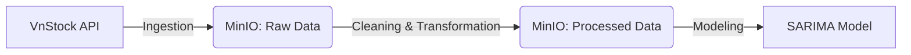

# StockForecasting 📈


## 📖 About The Project

**StockForecasting** is an end-to-end data engineering and machine learning pipeline designed to predict stock trends.

The system ingests market data from the **VnStock API**, stores raw and processed data in a **MinIO** data lake (S3-compatible object storage), and transforms it into training-ready datasets for **SARIMA** time-series models.

### Key Features
* **Orchestration:** Built with [Dagster](https://dagster.io/) for asset-based data orchestration.
* **Data Lake:** Uses MinIO for persistent storage of raw, intermediate, and modeled data.
* **Partitioning:** Implements monthly partitioning for efficient historical data backfills.
* **Modeling:** Automates the training of SARIMA models for specific stock tickers.

---

## 🏗 Architecture

The pipeline follows a structured flow:



1. **Ingestion:** Fetches historical data (partitioned by month) from VnStock.
2. **Storage:** Loads data into MinIO buckets using a custom `MinIOIOManager`.
3. **Transformation:** Cleans and formats data for time-series analysis.
4. **Modeling:** Trains SARIMA models on the transformed data.

---

## 📂 Project Structure

```text
├── docker-compose.yaml         # Container orchestration for MinIO & PostgreSQL
├── pyproject.toml              # Dependency management
├── data/                       # Local volume mount for MinIO data (gitignored)
├── src/
│   └── StockForecasting/
│       ├── definitions.py      # Main Dagster entry point
│       └── defs/
│           ├── assets/         # Core logic
│           │   ├── ingestion.py      # API Data fetching
│           │   ├── cleaning.py       # Data quality checks
│           │   ├── transformation.py # Feature engineering
│           │   └── modeling.py       # SARIMA model training
│           ├── partition_defs/       # Monthly partition configurations
│           ├── resources/
│           │   ├── minio_io_manager.py # Custom IO Manager for Object Storage
│           │   └── psql_io_manager.py  # (Planned) Postgres IO for BI tools
│           └── tickers/
│               └── tickers.csv         # Config: Ticker symbols to track
└── tests/                      # Unit and integration tests

```

---

## 🚀 Getting Started

### 1. Prerequisites

Before running the Python code, you must have the infrastructure running.

* **Docker:** Ensure Docker Desktop is installed and running.
* **Environment Variables:** Create a `.env` file in the root directory (if required by your code) to store MinIO credentials.

### 2. Start Infrastructure

Spin up the MinIO and PostgreSQL containers:

```bash
docker-compose up -d

```

### 3. Install Dependencies

**Option A: Using uv (Recommended)**

[uv](https://docs.astral.sh/uv/) is a fast Python package installer and resolver.

```bash
# Sync dependencies
uv sync

# Activate virtual environment
# Windows
.venv\Scripts\activate
# MacOS/Linux
source .venv/bin/activate

```

**Option B: Using pip**

```bash
# Create virtual environment
python3 -m venv .venv

# Activate virtual environment
# Windows
.venv\Scripts\activate
# MacOS/Linux
source .venv/bin/activate

# Install dependencies in editable mode
pip install -e ".[dev]"

```

### 4. Running the Pipeline

Start the Dagster UI web server:

```bash
dagster dev

```

Open [http://localhost:3000](https://www.google.com/search?q=http://localhost:3000) in your browser. From here, you can materialize assets, trigger backfills for historical months, and monitor the pipeline runs.

---

## 🔮 Roadmap

* [ ] **Streamlit Interface:** Develop a frontend application to visualize model predictions and compare them against actual market movements.
* [ ] **PostgreSQL Integration:** Implement `psql_io_manager` to serve data to BI tools (e.g., Metabase/Superset) via dbt.
* [ ] **Model Registry:** Version control trained models using MLflow or Dagster's metadata.

---

## 📄 License

Distributed under the MIT License. See `LICENSE` for more information.

---

## 📚 Learn More

To learn more about the tools used in this project:

* [Dagster Documentation](https://docs.dagster.io/)
* [MinIO Object Storage](https://min.io/)
* [VnStock Library](https://github.com/thinh-vu/vnstock)

```

```
